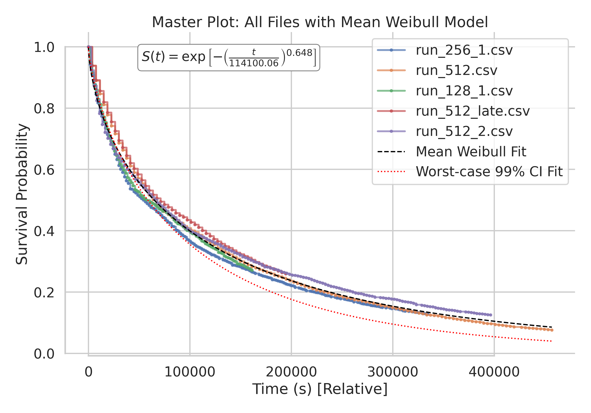

# Pkarr Key Churn Behavior Analysis

We conducted experiments to analyze pkarr key churn behavior running `cargo run --bin nodes_decay` several times and analyzing with `analyze_multiple_nodes_storing.py`. Below are our key findings:

## **Key Observations**

- **Node churn follows a Weibull distribution.** This is essentially an exponential decay (characterized by a half-life parameter, λ), with an additional shape parameter (`k`) that adjusts for variations in churn risk over time.

- **Consistent Weibull model fit.** Experiments were repeated multiple times, varying start times, node counts, and publishing intervals. The Weibull model consistently provided an excellent fit across all scenarios.

- **Early churn risk is high (`k` < 1).** This means that nodes have a higher likelihood of churning shortly after publishing, but the risk significantly decreases over time. This aligns with intuition—many nodes turn on/off hourly or daily, while a smaller subset remains online continuously. The longer a record persists, the more likely it is stored on a stable, "always-on" node.

- **Publishing time influences survival rates.** While the impact is relatively small, publishing around **23:30–02:00 UTC** increases survival probability. Nodes active at these hours are more likely stable, pushing the shape parameter `k` closer to ~0.8 and increasing the half-life. Conversely, publishing between **11:00–18:00 UTC** (afternoon/evening EU/US time) results in a higher likelihood of early churn, as many nodes go offline within hours.

Below is a consolidated plot of all experiments. The **black dotted line** represents the mean Weibull fit, while the **red dotted line** shows the worst-case 99% confidence interval (CI). To ensure robustness, we base our survival probability estimates on the **99% worst-case model**.



## **Survival Probabilities (Lower 99% CI)**

Using a Gaussian assumption for half-life and shape parameter distributions, we derived a conservative Weibull model at the **99% confidence interval**, predicting survival probabilities across different replication counts:

| Replication | 1 Hour  | 1 Day   | 2 Days  | 1 Week  | 1 Month |
| ----------- | ------- | ------- | ------- | ------- | ------- |
| 1           | 85.93%  | 38.87%  | 23.90%  | 3.12%   | 0.00%   |
| 2           | 98.16%  | 62.78%  | 42.16%  | 6.20%   | 0.00%   |
| 4           | 99.97%  | 86.34%  | 66.70%  | 12.24%  | 0.00%   |
| 10          | 100.00% | 99.36%  | 93.77%  | 28.99%  | 0.00%   |
| 20          | 100.00% | 100.00% | 99.64%  | 51.61%  | 0.00%   |
| 50          | 100.00% | 100.00% | 100.00% | 86.40%  | 0.00%   |
| 100         | 100.00% | 100.00% | 100.00% | 98.55%  | 0.00%   |
| 1000        | 100.00% | 100.00% | 100.00% | 100.00% | 0.00%   |

## **Optimization: Minimizing DHT Load**

To balance high availability with minimal overhead, we define **replication cost** as:

```
cost = node_count / republishing_interval
```

where cost is measured in **nodes/hour**. Our goal is to minimize this value while ensuring availability.

### **Optimal Conservative Configuration (≥99.9% Availability)**

- **Replication Count:** 17 nodes
- **Republishing Interval:** ~30 hours
- **Cost:** **0.566 nodes/hour** (minimal resource usage to achieve ≥99.9% availability conservatively)

### **Optimal Steady-State Configuration (≥99.9% Availability)**

By considering persistent long-lived nodes, we can refine the strategy further:

- **Replication Count (per batch):** 5 nodes (a true optimum would suggest 1 node every 3–4 hours, but we impose a minimum of 5)
- **Republishing Interval:** ~17.7 hours
- **Cost:** **0.283 nodes/hour** (significantly lower long-term overhead)

## **Final Recommendation**

1. **Initial Publishing:** Publish to **17 nodes** to achieve **≥99.9% availability for ~30 hours**.
2. **Steady-State Optimization:** After a few days, transition to **publishing in batches of 5 nodes every ~17 hours**. This balances availability while minimizing DHT load.
3. **Expected Replication Levels:** Over time, the number of live copies fluctuates between **7–12 nodes**, ensuring robust persistence with minimal resource usage.

This approach ensures high reliability while imposing the least burden on the network.

These findings are open to be revised as more empirical evidence comes in. Please not that the Dht behavior might change over time, so run the experiments once again yourself to replicate this research if needed in the future.
